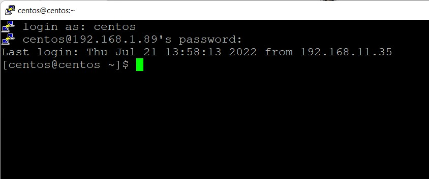
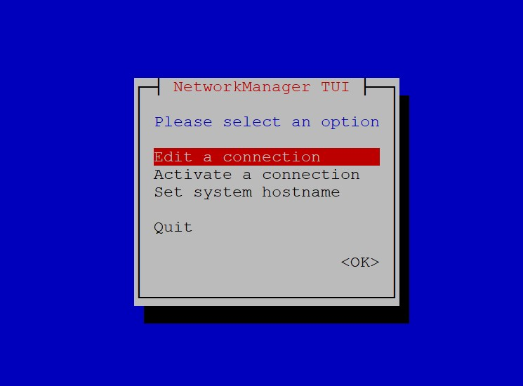

# Reza Sysadmin 2022 | Nomor Soal 4


1. Untuk mengerjakan soal kita perlu meyiapkan akun Github dahulu, daftar di halaman https://github.com/signup sampai berhasil login di halaman pembuatan repository baru.


2. Lanjut untuk menulis dokumentasi menggunakan Mkdocs perlu modul “pip” dan instalasi Python di komputer lokal, download dahulu di halaman https://www.python.org/downloads/ kemudian install sampai selesai. 


3. Setelah instalasi Python selesai “pip” sudah include dalam instalasi ini lalu untuk memasikan versinya buka CMD dengan akses Administrator ketik command pip –version 


4. Versi pip sudah diketahui tebaru menggunakan 22.0 lanjut melakukan instalasi mkdocs dengan command pip install mkdocs tunggu prosesnya sampai selesai


5. Untuk menulis dokumentasi test ini menggunakan Markdown perlu membuat project dahulu dengan perintah “mkdocs new reza-sa” dan bila sudah pergi ke direktori instalasi dengan perintah “cd reza-sa” karena lokasi file mkdocs saya berada di C:\Users\Reza\reza-sa\

Lanjut eksekusi untuk menjalankan mkdocs server di local dengan perintah “mkdocs serve” agar dapat diakses melalui browser

Saat menulis panduan ini saya menggunakan aplikasi editor kode Visual Studio Code dengan tambahan plugin Markdown All in One agar memudahkan saat dokumentasi pekerjaan.


6. Akses ssh ke vm dengan tabel akses default Port ssh 1 ke 192.168.1.89:2234 menggunakan aplikasi ssh/putty dan login menggunakan user/pass yang disediakan.


7. Selanjutnya perlu cek pada interface pertama dari dhcp ke ip static, cek dahulu status device dan koneksi yang ada di vm ini dengan perintah “ip a” , diketahui ada 1 koneksi terhubung via lan dengan -eth0- lalu saya mencatat bagian koneksi nomor 2 yaitu link/ether 0c:ca:7e:64:00:34 dalam notepad, sekali lagi lakukan perintah “uuidgen eth0” untuk generate user id yang diperlukan untuk seting ip static nantinya, 2 kotak merah dalam gambar digunakan untuk konfigurasi. 


8. Lanjut edit file konfigurasi network yang terletak di /etc/sysconfig/network-scripts/ifcfg-eth0 menggunakan view, dengan command “sudo vi /etc/sysconfig/network-scripts/ifcfg-eth0” klik tombol i untuk insert/merubah isi teksnya isikan sesuai konfigurasi soal jika sudah ketik perintah “wq!” untuk save editor.


9. Lanjut verifikasi file ifcfg-eth0 yang tadi sudah di edit dengan perintah “cat /etc/sysconfig/network-scripts/ifcfg-eth0” untuk memastikan file sudah benar dan tersimpan di VM. 


10. Lanjut melakukan restart service koneksi dengan perintah “systemctl restart network” masukan sandi user centos yang digunakan agar terverifikasi.


11. Setelah melakukan langkah diatas koneksi ssh di putty akan terputus karena perubahan IP, lanjut kita login menggunakan port ssh2 192.168.1.89:2254 menggunakan putty kembali dan login menggunakan user centos untuk menyiapkan ssh authorized_keys.


12. Setelah berhasil login biarkan saja dahulu, lanjut buka CMD lokal windows gunakan perintah “ssh-keygen -t rsa” untuk membuat ssh key, disini saya mengkosongkan passphrase dengan tekan Enter semua sampai prosesnya selesai.


13. Lanjut kita akan instal sshkey di server kembali ke putty lagi di langkah 11, ketika saya membuat direktori .ssh ternyata sudah ada di home centor, lalu saya rubah saja owner saja ke 700. 


14. Ternyata di VM ini untuk authorized keys sudah ada didalam folder .ssh maka tinggal edit filenya menggunakan vi dan masukan public key (isi dari id_rsa.pub) tadi dari direktori lokal (langkah 12) simpan kemudian pastikan file sudah benar dengan cek ulang perintah cat authorized_keys


15. Lanjut ubah permision agar hanya dapat Read/Write saja dengan menggunakan perintah “chmod 600 authorized_keys” dan konfigurasi ssh keys sudah selesai. 


16. Test kembali akses login SSH di lokal, disini karena windows maka menggunakan CMD dengan perintah ssh -p2254 centos@192.168.1.89 jika muncul notifikasi fingerprint ketik yes saja dan berhasil login tanpa perlu password melalui CMD.
Saya menggunakan CMD agar menyingkat waktu dibandingkan putty perlu seting dan memasukan private key dahulu di Putty nya.


17. Sebelum melakukan instalasi Nginx perlu memastikan konfigurasi IP Private 1 dengan perintah perintah berikut dari CLI hasil akhir sudah bisa ping ke google.com


18. Selanjutnya akan melakukan instalasi Nginx Server di VM ini, buat dahulu file konfigurasi dengan perintah “sudo vi /etc/yum.repos.d/nginx.repo” dan isikan konfigurasi berikut dalam filenya:
```java
[nginx]
name=nginx repo
baseurl=http://nginx.org/packages/mainline/centos/7/$basearch/
gpgcheck=0
enabled=1
```


19. Lanjut melakukan instalasi nginx dengan menggunakan perintah “sudo yum install nginx" dan tunggu prosesnya sampai selesai.


20. Jika ada notifikasi tekan tombol y saja sampai prosesnya selesai seperti ini, pastikan semua sudah complete.


21. Lanjut akan menjalankan service nginx dengan perintah “service nginx start” lalu akan diminta sandi otentikasi masukan sandi user centos sampai complete.


22. Jika sudah cek service nginx dengan perintah “service nginx status” pastikan sudah hijau running tandanya nginx sudah berjalan dengan baik. 


23. Lanjut melakukan seting mod rewrite ke nginx webserver agar htaccess secara umum dapat digunakan karena teknisnya nginx berbeda dengan apache, maka edit file konfigurasi dengan perintah “sudo vi /etc/nginx/conf.d/default.conf” lalu rubah bagian yang diblok ke:
```java
[nginx]
name=nginx repo
baseurl=http://nginx.org/packages/mainline/centos/7/$basearch/
gpgcheck=0
enabled=1
```


24. Menginstall versi php-fpm 7.3 dan 7.4 di webserver nginx-centos7 pertama membutuhkan epel repository, gunakan perintah “sudo yum install epel-release” sampai selesai prosesnya.


25. Proses selanjutnya melakukan instalasi remi repository dengan perintah “sudo yum install http://rpms.remirepo.net/enterprise/remi-release-7.rpm” dan tunggu prosesnya sampai selesai.


26. Jika sudah selesai lanjut instalasi paket yum-utils dengan menggunakan perintah “sudo yum install yum-utils” dan tunggu proses sampai selesai.
27. Lanjut mengaktifkan konfigurasi versi php yang dibutuhkan yaitu 7.3, 7.4, dan 8.0 menggunakan perintah berikut:
sudo yum-config-manager --enable remi-php73
sudo yum-config-manager --enable remi-php74
sudo yum-config-manager --enable remi-php80
27.  Setelah semua proses diatas selesai lanjut instalasi ekstensi php yang dibutuhkan dengan perintah berikut:
sudo yum -y install php php-fpm php-mysqlnd php-zip php-devel php-gd php-mcrypt php-mbstring php-curl php-xml php-pear php-bcmath php-json php-pdo php-pecl-apcu php-pecl-apcu-devel


29. Lanjut untuk proses konfigurasi php-fpm buka file /etc/php.ini lalu tambahkan baris cgi.fix_pathinfo=0


30. Lanjut buka file www.conf di direktori dengan perintah “sudo nano /etc/php-fpm.d/www.conf” lalu rubah bagian:
```
user = centos
group = centos
listen.owner = centos
listen.group = centos
```
Karena user saya pada VM ini menggunakan nama centos


31. Jika sudah selesai lanjut kita akan menjalankan proses php-fpm di server dan juga saat boot secara otomatis, gunakan perintah ini:
```
sudo systemctl start php-fpm
sudo systemctl enable php-fpm
```
Jika sudah cek status service php-fpm dengan perintah ini “sudo systemctl status php-fpm”


32. Seting IP interface kedua perlu menggunakan network manager, disini saya menggunakan nmtui dan pastikan sebelumnya sudah melakukan instalasi ntmui di VM ini. Ketik perintah nmtui untuk masuk e konfigurasi pilih Edit Connection.

Ketika sudah masuk pilih menu Add, profile name dan device saya isikan eth1 dan IP Private kedua 172.16.8.54 simpan jika sudah.


31. Lanjut saya mencoba konfigurasi file php info tambahan, setelah dicari direktori template website berada di /usr/share/nginx/html/ kemudian saya membuat file php info dengan mkdir folder baru php73/ dan mengisi script php info

Test akses ke web direktori utama /usr/share/nginx/html sudah bisa tampil diakses dengan http://192.168.1.89:854/ sudah dapat tampil berikut


Saat melakukan test akses direktori phpinfo /php73 ternyata koneksi RTO hasilnya, pengecekan melalui curl muncul hasil seperti ini:
```
[idweb@remote ~]$ curl -I http://192.168.1.89:854/php73
HTTP/1.1 301 Moved Permanently
Server: nginx/1.23.1
Date: Sat, 23 Jul 2022 14:20:30 GMT
Content-Type: text/html
Content-Length: 169
Location: http://192.168.1.89/php73/
Connection: keep-alive
```
Port akses otomatis ter’redirect ke non port 854 dengan eror 301, kemudian saya coba melakukan langkah selanjutnya dahulu untuk instalasi telnet-server.

32. Gunakan perintah “sudo yum install telnet-server telnet” 


33. Jika sudah lanjut instalasi firewalld agar dapat mengkonfigurasi dan membuka telnet port 23 agar dapat dilakukan akses secara menyeluruh. 
Gunakan perintah “sudo yum install telnet-server telnet” tunggu prosesnya sampai selesai.
Selanjutnya juga perlu instalasi firewall, gunakan perintah “sudo yum install firewalld” tunggu sampai selesai prosesnya. 
Setelah instalasi selesai gunakan perintah ini untuk konfigurasi yang diperlukan.
```
$ sudo systemctl start firewalld
$ sudo systemctl enable firewalld
$ sudo systemctl status firewalld
```
Jika sudah gunakan perintah berikut untuk konfigurasi firewall port 80 dan akses telnet:
$ sudo firewall-cmd --zone=public --add-port=80/tcp --permanent
$ sudo firewall-cmd --reload
$ sudo firewall-cmd --add-service=telnet --zone=public


Test akses telnet menggunakan perintah “telnet 172.16.8.1 80” hasilnya sudah terhubung.


Install wget untuk mendownload file template menggunakan perintah “sudo yum install wget” tunggu proses selesai, jika sudah pastikan berada di direktori /usr/share/nginx/html/ kemudian lanjut ketik perintah “sudo wget http://172.16.8.1/web.tar.gz”


Lanjut instalasi phpmyadmin dengan perintah “sudo yum install phpmyadmin” tunggu sampai selesai prosesnya.


Buat konfigurasi file symlink dengan perintah “sudo ln -s /usr/share/phpMyAdmin /usr/share/nginx/html/phpmyadmin” agar file phpmyadmin dapat dijalankan.
Symlink sudah dibuat lanjut restart php-fpm dengan perintah “sudo systemctl restart php-fpm”

Disini saya mencoba mengakses kembali phpmyadmin namun hasilnya tetap tidak bisa karena kemungkinan konfigurasi php konfig di nginx ada yang tidak sesuai, sudah dicoba untuk mod rewrite ulang dengan script yang benar masih belum memberikan hasil.
Semua service pada server terlihat jalan dengan baik tanpa kendala. 

Namun jika diakses dengan subdir lain contoh /phpmyadmin selalu menghasilkan RTP dan hasil dari Curl 301 redirect.
```
[idweb@remote ~]$ curl -I http://192.168.1.89:854/phpmyadmin
HTTP/1.1 301 Moved Permanently
Server: nginx/1.23.1
Date: Sun, 24 Jul 2022 04:06:56 GMT
Content-Type: text/html
Content-Length: 169
Location: http://192.168.1.89/phpmyadmin/
Connection: keep-alive
```
Sampai saat ini saya mencoba mencari klue penyebabnya dan bertanya ke teman2 SA senior namun belum menemukan penyebab dan klue kendala berasal dari mana. 

Sekian hasil tes simulasi VM ini, terimakasih sudah memberi kesempatan untuk mencoba :) 


